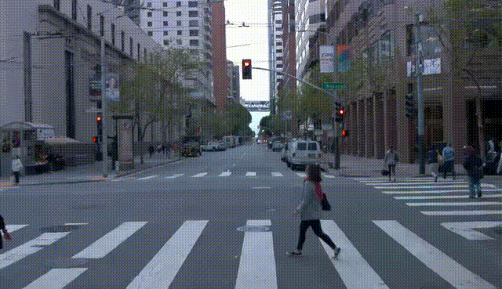

# DriVerse
**DriVerse: Navigation World Model for Driving Simulation via Multimodal Trajectory Prompting and Motion Alignment**  
[📄 View on arXiv (2504.18576)](https://arxiv.org/pdf/2504.18576)

## Abstract
This paper presents DriVerse, a generative model for simulating navigation-driven driving scenes from a single image and a future trajectory. Previous autonomous driving world models either directly feed the trajectory or discrete control signals into the generation pipeline, leading to poor alignment between the control inputs and the implicit features of the 2D base generative model, which results in low-fidelity video outputs. Some methods use coarse textual commands or discrete vehicle control signals, which lack the precision to guide fine-grained, trajectory-specific video generation, making them unsuitable for evaluating actual autonomous driving algorithms. DriVerse introduces explicit trajectory guidance in two complementary forms: it tokenizes trajectories into textual prompts using a predefined trend vocabulary for seamless language integration, and converts 3D trajectories into 2D spatial motion priors to enhance control over static content within the driving scene. To better handle dynamic objects, we further introduce a lightweight motion alignment module, which focuses on the inter-frame consistency of dynamic pixels, significantly enhancing the temporal coherence of moving elements over long sequences.
We also propose an inference-time strategy to address issues caused by rapid vehicle heading changes.
With minimal training and no need for additional data, DriVerse outperforms specialized models on future video generation tasks across both the nuScenes and Waymo datasets. The code and models will be released to the public.

---

## 🎬 Demo Videos

| Demo | Description |
|------|-------------|
|  | **Waymo: Straight Trajectory Expansion**  |
|  | **Waymo: Right Turn Expansion**  |
|  | **VISTA Screenshot: Straight Trajectory**  |
|  | **Non-Rigid Generation (e.g., Pedestrians)** |

---

> 🚧 **Full code and data coming soon. Stay tuned!**


## 🛠️ Environment Setup

Please follow the environment setup instructions provided in our companion repository  
👉 [`WanControl`](https://github.com/shalfun/WanControl)

It contains detailed steps and environment dependencies to get the training pipeline running.

---

## 🏋️ Training

To launch training on the Waymo dataset with trajectory control, simply run:

```bash
bash train_wm_i2v_vae_control.sh
